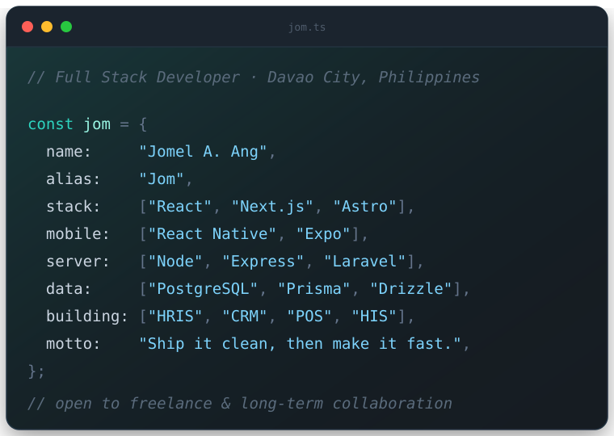

<!-- ══════════════════ HERO ══════════════════ -->

  

  

  
  
  

 

<!-- ══════════════════ ABOUT ══════════════════ -->

## 👋 About Me

  

- 🏢 &nbsp;I build **enterprise-grade systems for the Philippine market** — HRIS, CRM, POS, and hospital information systems with role-based access and full API integration.
- 🧮 &nbsp;Comfortable with the unglamorous parts: **SSS / PhilHealth / Pag-IBIG / TRAIN Law payroll math**, multi-branch inventory, and PhilHealth claim flows.
- 📱 &nbsp;Web *and* mobile — **React + Vite** on the browser, **React Native + Expo** on the phone, one shared API underneath.
- 🎨 &nbsp;I take designs seriously. Figma spec in, pixel-faithful build out.
- 🌐 &nbsp;Portfolio → **[jaang.dev](https://jaang.dev)**

 

<!-- ══════════════════ STACK ══════════════════ -->

## 🧰 Tech Stack

<b>Frontend</b>

 

  
  
  
  
  
  
  
  

<b>Mobile</b>

 

  
  

<b>Backend &amp; Data</b>

 

  
  
  
  
  
  
  
  

<b>Tooling &amp; Deploy</b>

 

  
  
  
  
  

 

<!--
  ══════════════════ STATS ══════════════════
  Served by github-stats-extended, a maintained fork of github-readme-stats
  with its own (less saturated) instance. Same query params as the original.
  If these ever go blank, the durable fix is self-hosting — see notes below.
-->

## 📊 GitHub Stats

  
  

 

## 🔥 GitHub Streak 

  

 

<!-- ══════════════════ PROJECTS ══════════════════ -->

## 🚀 Selected Work

<table>
  <tr>
    <td width="50%" valign="top">
      <h3>🧑‍💼 IHP HRIS</h3>
      
Human resource information system for a Philippine corporation — web dashboard plus a companion mobile app, sharing one TypeScript API.

      

        
        
        
        
      

    </td>
    <td width="50%" valign="top">
      <h3>📇 mycrm</h3>
      
Personal CRM layered onto my portfolio — clients, projects, payments, analytics, plus a read-only guest mode and role-scoped contact logins.

      

        
        
        
        
      

    </td>
  </tr>
  <tr>
    <td width="50%" valign="top">
      <h3>🏥 GTC Imaging</h3>
      
Hospital information system frontend with real-time updates, telemedicine video, and PhilHealth integration.

      

        
        
        
      

    </td>
    <td width="50%" valign="top">
      <h3>🌐 Marketing Sites</h3>
      
Fast, design-faithful static sites built from Figma specs — restaurant, medical, and industrial clients.

      

        
        
        
      

    </td>
  </tr>
</table>

 

<!--
  ══════════════════ SNAKE ══════════════════
  Generated by .github/workflows/snake.yml into the "output" branch.
  This section stays blank until that workflow has run at least once.
-->

## 🐍 Contribution Snake

  <picture>
    <source media="(prefers-color-scheme: dark)" srcset="https://raw.githubusercontent.com/JomsWick/JomsWick/output/github-snake-dark.svg" />
    <source media="(prefers-color-scheme: light)" srcset="https://raw.githubusercontent.com/JomsWick/JomsWick/output/github-snake.svg" />
    
  </picture>

 

<!-- ══════════════════ CONTACT ══════════════════ -->

## 🤝 Let's Build Something

  Open to freelance projects, product work, and long-term collaborations. 
  Based in Davao City — working with teams anywhere.

  
  

  

